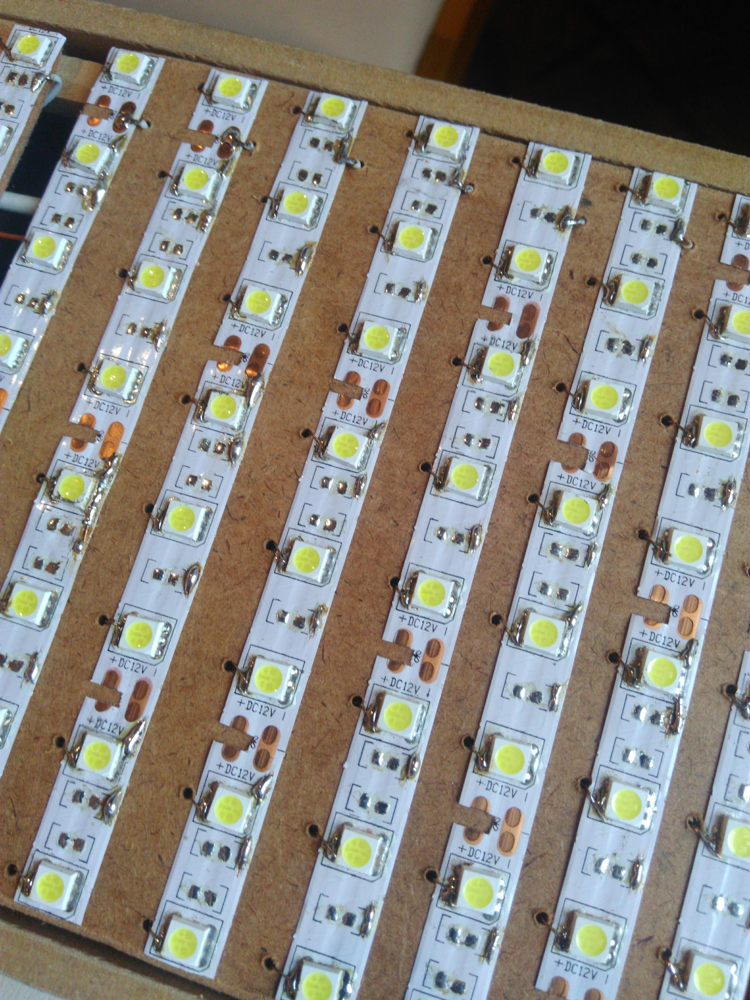
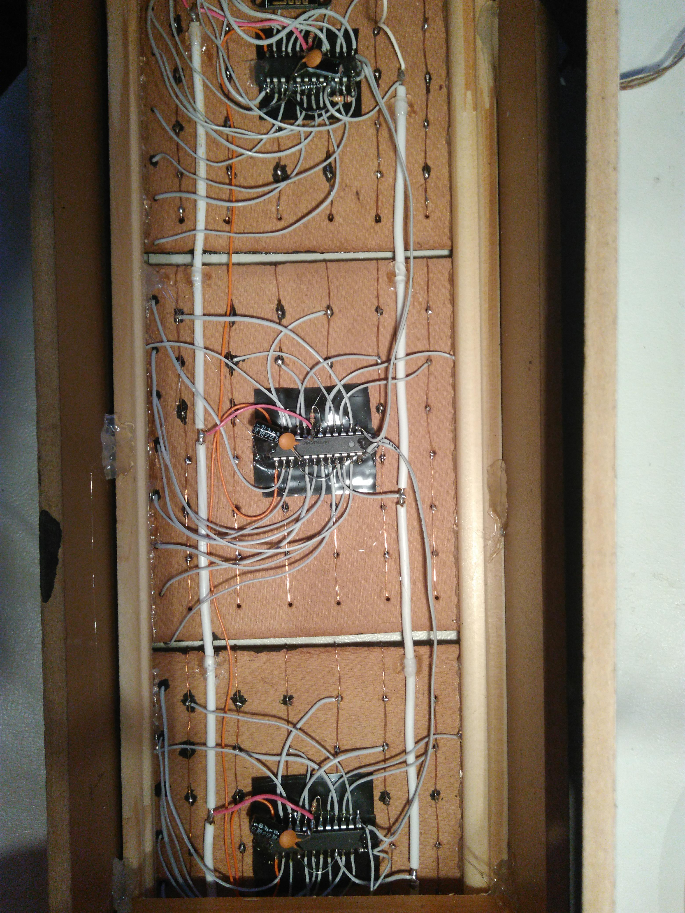
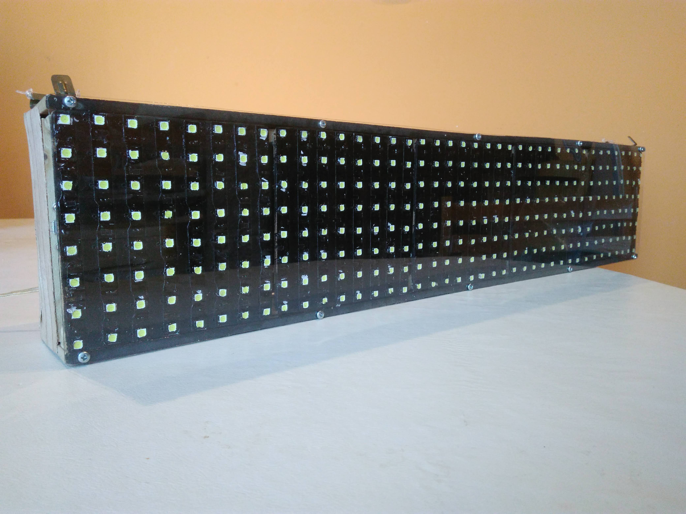

# Cartel Led 8 x 40

Cartel electrónico programable de LEDs en matriz de 8 x 40 manejados por 5 multiplexores [MAX7219](misc/max7219.pdf).

La lógica está programada en C++ sobre una placa [NodeMCU](https://github.com/nodemcu) utilizando [PlatormIO](https://platformio.org/) como entorno de desarrollo integrado con [Visual Studio Code](https://code.visualstudio.com/). Todo el código fuente se encuentra en este repositorio.

El armado de la matriz de leds es un experimento (con buen resultado) realizado con tiras de led 5050.

En el interior del cartel se encuentran los MAX7219, también conectados de manera "artesanal" :).

Luego, con un poco de pintura negra en la parte frontal del panel mejora un poco la vista y el contraste de cada led.

&nbsp;

---

## Video demostrativo

<video width="450" height="300" controls>
  <source src="misc/cartel-8x40-01.mp4" type="video/mp4">
Your browser does not support the video tag.
</video>

&nbsp;

---

## Interfaz de usuario

El dispositivo ofrece una interfaz de usuario web para programar los mensajes. La misma se despliega conectándose a la red WiFi que él mismo crea (JCB Display) y accediendo a la siguiente URL con cualquier navegador:

http://192.168.4.1:8081

&nbsp;

---

## Esquemático de cada una de las 5 matrices

&nbsp;

---

## Software de terceros

* [MD_Parola](https://github.com/MajicDesigns/MD_Parola)
* [platform-espressif8266](https://github.com/platformio/platform-espressif8266)
* [Visual Studio Code](https://code.visualstudio.com/)
* [Fritzing](https://fritzing.org/)
